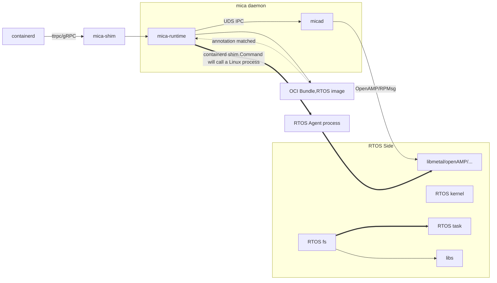

```mermaid

graph LR
    CD[containerd] -->|ttrpc/gRPC| S
    S[mica-shim] --> MR
    MR[mica-runtime] -->|UDS IPC| A[micad]
    MR -->C[OCI Bundle,RTOS image]
    MR ==>|containerd shim.Command will call a Linux process|AG[RTOS Agent process]
    A -->|OpenAMP/RPMsg| B[RTOS Remote Core]
    C -.->|annotation matched| MR
    AG ==>B
    subgraph RTOS Side
        B[libmetal/openAMP/...]
        K[RTOS kernel]
        D[RTOS fs] ==> E
        D --> L[libs]
        D
        E[RTOS task]
    end
    subgraph mica daemon
        A
        MR
    end

```