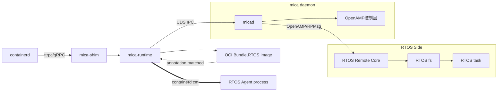

```mermaid

graph LR
    CD[containerd] -->|ttrpc/gRPC| S
    S[mica-shim] --> MR
    MR[mica-runtime] -->|UDS IPC| A[micad]
    MR -->C[OCI Bundle,RTOS image]
    MR ==>|containerd cm|AG[RTOS Agent process]
    A -->|OpenAMP/RPMsg| B[RTOS Remote Core]
    C -.->|annotation matched| MR
    subgraph RTOS Side
        B --> D[RTOS fs] --> E
        E[RTOS task]
    end
    subgraph mica daemon
        A --> F[OpenAMP控制层]
    end

```